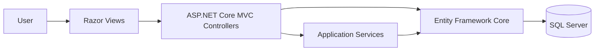
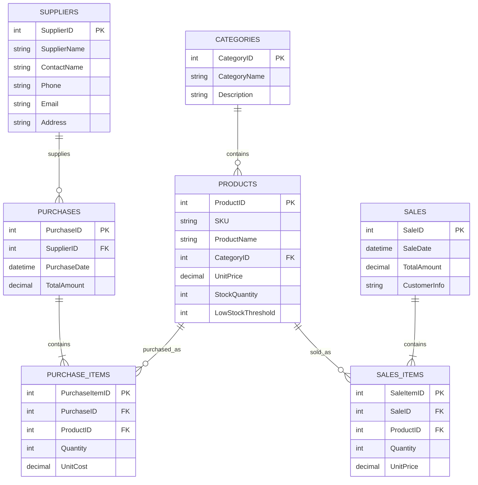
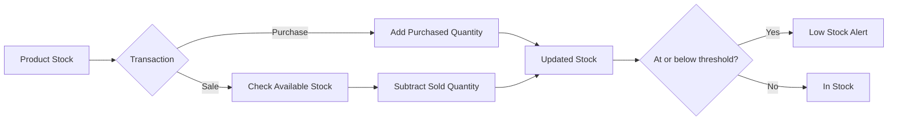

# Inventory Management System

> ITI Summer Training Graduation Project — a complete web-based inventory system built with ASP.NET Core MVC, Entity Framework Core, and SQL Server.


## Overview

The **Inventory Management System** helps a business manage products, categories, suppliers, purchases, sales, and stock from one web application.

The system automatically updates inventory quantities when purchases or sales are completed, provides low-stock visibility, offers operational dashboard analytics, and includes a natural-language inventory assistant for common business questions.

## Main Features

### Products
- Create, edit, view, and delete products
- Unique SKU validation
- Search by product name or SKU
- Filter by category and stock status
- Pagination
- In Stock / Low Stock / Out of Stock indicators
- Product deletion protection when historical transactions depend on the product

### Categories
- Full category CRUD
- Search by category name or description
- View products inside each category
- Category-level stock overview
- Duplicate category-name validation
- Prevent deletion of categories that still contain products

### Suppliers
- Full supplier CRUD
- Store contact name, phone, email, and address
- Supplier details with:
  - total purchases
  - total purchase value
  - supplied products
  - quantity supplied
  - purchase history
  - last purchase date
- Prevent deletion of suppliers with purchase history

### Purchases
- Create purchases from a selected supplier
- Add multiple products to one purchase
- Prevent duplicate products in the same transaction
- Enter quantity and unit cost
- Automatic line totals and purchase total
- Automatically **increase product stock**
- Database transaction protection
- Search by purchase number or supplier
- Filter by supplier and date range
- Purchase history and detailed receipt
- Printable purchase details

### Sales
- Create sales with multiple products
- Customer information support
- Validate available stock before completing a sale
- Prevent duplicate products in one sale
- Automatic sale total
- Automatically **decrease product stock**
- Database transaction protection
- Search sales history
- Sale details and printable receipt

### Inventory
- Real-time stock quantities
- Search by product name or SKU
- Low-stock filtering
- Product-specific reorder thresholds

### Dashboard
The dashboard summarizes important operational information:

- Total products
- Total categories
- Total suppliers
- Total stock quantity
- Low-stock products
- Total purchases and purchase value
- Total sales and sales revenue
- Recent purchases
- Recent sales
- Most sold products

### Inventory Assistant

The project includes a **natural-language, intent-based inventory assistant** connected to the application database.

It can answer common inventory questions such as:

- Which products are low in stock?
- What are the most sold products?
- What are the lowest-selling products?
- What is the total sales revenue?
- What is the total inventory quantity?
- Who is the top supplier?
- What are the recent sales?
- Which products generated the highest revenue?
- Which products should be restocked?

> The current implementation performs local intent detection and queries the system database directly. It does not require an external LLM/API.

---

## Technology Stack

| Layer | Technology |
|---|---|
| Backend | C# / ASP.NET Core MVC |
| Framework | .NET 10 |
| ORM | Entity Framework Core 10.0.11 |
| Database | Microsoft SQL Server |
| Frontend | Razor Views, HTML, CSS, JavaScript |
| UI | Bootstrap |
| Architecture | MVC |
| Database Management | EF Core Migrations |
| Version Control | Git & GitHub |

---

## System Architecture



---

## Database Design

The project uses the following core entities:

- Categories
- Products
- Suppliers
- Purchases
- PurchaseItems
- Sales
- SalesItems



---

## Stock Workflow



---

## Project Structure

```text
InventorySystem/
├── Controllers/
│   ├── AIAssistantController.cs
│   ├── CategoriesController.cs
│   ├── DashboardController.cs
│   ├── InventoryController.cs
│   ├── ProductsController.cs
│   ├── PurchasesController.cs
│   ├── SalesController.cs
│   └── SuppliersController.cs
├── Models/
│   ├── Category.cs
│   ├── Product.cs
│   ├── Supplier.cs
│   ├── Purchase.cs
│   ├── PurchaseItem.cs
│   ├── Sale.cs
│   ├── SaleItem.cs
│   └── InventoryContext.cs
├── Services/
│   └── AIAssistantService.cs
├── ViewModels/
├── Views/
├── Migrations/
├── Database/
├── wwwroot/
├── Program.cs
├── appsettings.json
└── InventorySystem.csproj
```

---

## Getting Started

### Prerequisites

Install:

- .NET 10 SDK
- Microsoft SQL Server
- Visual Studio with ASP.NET and web development workload, or another .NET-compatible IDE
- Entity Framework Core tools if you plan to manage migrations

### 1. Clone the repository

```bash
git clone https://github.com/OmarElsawy7/Inventory-Management-System-ITI.git
cd Inventory-Management-System-ITI
```

### 2. Configure the database connection

The default configuration uses:

```text
Server: (local)
Database: InventoryManagementDB
Authentication: Windows Integrated Security
```

Update the `DefaultConnection` value in `appsettings.json` if your SQL Server instance is different.

Example:

```json
"ConnectionStrings": {
  "DefaultConnection": "Data Source=(local);Initial Catalog=InventoryManagementDB;Integrated Security=True;TrustServerCertificate=True"
}
```

### 3. Restore packages

```bash
dotnet restore
```

### 4. Apply database migrations

Using the .NET CLI:

```bash
dotnet ef database update
```

Or in Visual Studio Package Manager Console:

```powershell
Update-Database
```

If the EF CLI tool is not installed:

```bash
dotnet tool install --global dotnet-ef --version 10.0.11
```

### 5. Run the application

```bash
dotnet run
```

Or open `InventorySystem.slnx` in Visual Studio and run the project.

---

## Data Integrity

The system includes several safeguards to keep inventory data consistent:

- Purchases increase stock inside a database transaction
- Sales verify available stock before completion
- Sales decrease stock inside a database transaction
- Duplicate line items are rejected
- Supplier deletion is blocked when purchase history exists
- Product deletion is blocked when transaction history depends on it
- Category deletion is blocked when products still belong to it
- Model validation prevents invalid quantities and values

---

## Team 1

| # | Team Member |
|---:|---|
| 1 | Abdallah Ahmed Eloraby Emam |
| 2 | Amr Mohamed Mohrous Abdelkhalek |
| 3 | Karim Amr Mohamed Saad |
| 4 | Mohamed Ahmed Gamal Abd Elfatah |
| 5 | Omar Mohamed Abdelgwad Elsawy |
| 6 | Youssef Ahmed Mahmoud Elhnawy |

---

## Project Context

This project was developed as an **ITI Summer Training Graduation Project** using ASP.NET Core MVC and SQL Server, with the goal of applying database design, Entity Framework Core, MVC architecture, inventory business logic, analytics, and collaborative software development in one integrated application.

---

## Repository

**Owner:** [OmarElsawy7](https://github.com/OmarElsawy7)  
**Repository:** [Inventory-Management-System-ITI](https://github.com/OmarElsawy7/Inventory-Management-System-ITI)
